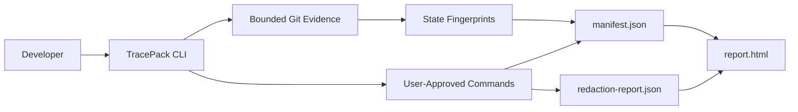

# Architecture

TracePack is a TypeScript/Node CLI. It shells out to local Git with bounded commands, runs only
commands the user passes after `tracepack run --`, writes local JSON artifacts, and renders a static
HTML report.

Phase 2 adds receipt-grade final-state validation by comparing command pre-state fingerprints with
the final repository-state fingerprint. The fingerprints use local Git/worktree metadata, safe file
hashes already allowed by the redaction rules, diff stats, and excluded-evidence markers. They do
not store full source contents or full raw diffs.

No hosted backend, database, auth, billing, browser extension, source upload, Docker requirement,
agent-session capture, or external model API is part of the core architecture.
