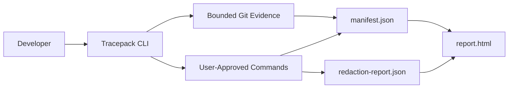

# Architecture

Tracepack v0.1 is a TypeScript/Node CLI. It shells out to local Git with bounded commands, runs only
commands the user passes after `tracepack run --`, writes local JSON artifacts, and renders a static
HTML report.

No hosted backend, database, auth, billing, browser extension, source upload, Docker requirement, or
external model API is part of the core v0.1 architecture.
